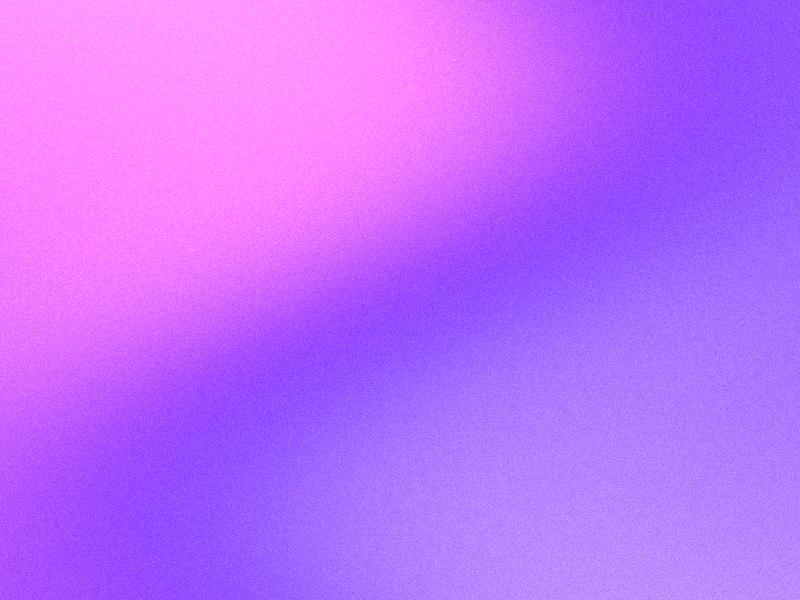

# Background Generator

A Rust command-line tool for still backgrounds and animations. **Choose a style explicitly** on every run:

- `noise`: the original softly blurred, flowing noise renderer.
- `balatro`: bold spiral paint ribbons, with independent rotation and paint flow.
- `grainient`: soft warped gradients with configurable film grain.

The new effects are original CPU implementations inspired by the React Bits [Balatro](https://www.reactbits.dev/backgrounds/balatro) and [Grainient](https://www.reactbits.dev/backgrounds/grainient) examples, not pixel-identical shader ports. No browser or GPU is required.

## Build

Install [Rust](https://www.rust-lang.org/tools/install), then run:

```sh
cargo build --release
```

PNG export works directly. Video export additionally requires [FFmpeg](https://ffmpeg.org/) with `libx264` on your `PATH`.

## Quick start

```sh
# Balatro still image
./target/release/balatro_bg --style balatro --output spiral.png

# Grainient still image
./target/release/balatro_bg --style grainient --output gradient.png --pixelation 1

# Balatro animation with a seamless 10-second loop
./target/release/balatro_bg --style balatro --output spiral.mp4 \
  --duration 10 --loop --swirl-radius 0.7 --swirl-amount 5 \
  --spin-speed 0.4 --flow-speed 1.2 \
  --colors '#DE443B' --colors '#006BB4' --colors '#162325'

# Grainient animation with custom colors and animated grain
./target/release/balatro_bg --style grainient --output gradient.mp4 \
  --duration 8 --loop --pixelation 1 --time-speed 0.4 \
  --warp-strength 0.25 --blend-angle 30 --grain-amount 0.12 \
  --grain-animated --colors '#FF9FFC' --colors '#5227FF' --colors '#B497CF'

# Original renderer (existing settings still work; --style is now required)
./target/release/balatro_bg --style noise --output noise.mp4 \
  --duration 20 --width 800 --height 600 --turbulence 2 \
  --pixelation 8 --scale 0.08 --speed 10
```

### Rendered examples

| Balatro | Grainient |
| --- | --- |
|  |  |

## Common options

Run `./target/release/balatro_bg --help` for all flags.

| Option | Default | Meaning |
| --- | --- | --- |
| `--style` | **required** | `noise`, `balatro`, or `grainient` |
| `--output`, `-o` | `balatro_background.mp4` | `.png` still or `.mp4`, `.mov`, `.mkv` H.264 video; existing outputs are overwritten |
| `--colors`, `-c` | style palette | Repeat once per `#RRGGBB` color (quote shell values); Balatro and Grainient require exactly three, Noise accepts one or more |
| `--width`, `-w` / `--height`, `-H` | `800` / `600` | Output pixels, 1–16384; video dimensions must be even |
| `--duration`, `-d` | `5` | Seconds; video frame count is rounded from duration × fps |
| `--fps`, `-f` | `30` | Video frame rate, 1–240 |
| `--pixelation`, `-p` | `4` | Pixel block size; use 1 for smooth gradients. Noise retains its original blur; Grainient grain has independent resolution |
| `--time` | `0` | PNG sample time in seconds; also starts Balatro/Grainient videos at this time |
| `--loop` | off | Use periodic motion; details below |

Default palettes: Noise uses navy/plum/rose/red; Balatro uses red/blue/charcoal; Grainient uses pink/violet/lavender. Balatro's colors are primary, secondary, shadow. Grainient's colors run along the gradient in the supplied order.

### Balatro controls

| Option | Default | Meaning |
| --- | --- | --- |
| `--swirl-radius` | `0.65` | Positive radius relative to the shorter image dimension; larger values spread the pattern out |
| `--swirl-amount` | `4` | Spiral winding; 0 removes radial twisting, negative values reverse it |
| `--spin-speed` | `0.25` | Rotation radians/second; negative reverses direction |
| `--flow-speed` | `1` | Paint morphing speed; independent of rotation |
| `--rotation` | `0` | Initial orientation in degrees |
| `--turbulence`, `-t` | `1` | Nonnegative distortion strength |
| `--contrast` | `3.5` | Color edge sharpness, 0.1–20 |
| `--lighting` | `0.15` | Highlight intensity, 0–1 |

### Grainient controls

| Option | Default | Meaning |
| --- | --- | --- |
| `--time-speed` | `0.25` | Overall gradient animation speed; 0 freezes the gradient |
| `--warp-strength` | `0.3` | Wave distortion; 0 gives an unwarped gradient |
| `--warp-frequency` | `5` | Positive spatial frequency of gradient waves |
| `--warp-speed` | `2` | Wave motion speed |
| `--blend-angle` | `0` | Gradient orientation in degrees |
| `--blend-softness` | `0.6` | Color transition width, 0.01–2 |
| `--color-balance` | `0` | Shift palette coverage, −1–1 |
| `--grain-amount` | `0.1` | Grain intensity, 0–1; 0 disables grain |
| `--grain-scale` | `1` | Grain size in output pixels, 0.1–100; larger is coarser |
| `--grain-animated` | off | Animate the texture independently of gradient motion |
| `--seed` | `42` | Reproducible grain seed |
| `--contrast` | `1.5` | Tonal contrast, 0.1–20 |
| `--gamma` | `1` | Midtone adjustment, 0.1–5 |
| `--saturation` | `1` | Color saturation, 0–3; 0 gives grayscale |
| `--light-mode` | off | Pale, paper-like colors |

Balatro and Grainient also support `--center-x` and `--center-y` (0–1, default 0.5) and positive `--zoom` (default 1). Larger zoom magnifies the pattern. Style-specific flags only affect their corresponding renderer.

### Original Noise controls

`--speed` (`-s`, default 0.002), `--turbulence` (`-t`, default 1), and `--scale` (`-S`, default 0.003) retain the original effect. Larger scale gives more spatial detail. Noise samples on the pixelated grid, so changing pixelation also changes its pattern scale, as before.

## Still images and loops

To select a still later in an animation, use `--output preview.png --time 2.5`. PNG accepts odd dimensions and does not need FFmpeg.

Without `--loop`, Balatro and Grainient evolve continuously and the end of a video need not match its beginning. With `--loop`, their motion follows a closed circular trajectory over the clip duration; Balatro rotation oscillates rather than spinning continuously. Speeds control excursion size in this mode. Animated Grainient grain is periodic too. Noise loop mode rounds the absolute speed to a whole number of cycles (minimum one for nonzero speed); speed 0 freezes it. This fixes the old assumption that arbitrary noise speeds automatically produced loops.

The conceptual frame at the loop endpoint equals the first frame; the duplicate endpoint is omitted from the video. Playback repetition is controlled by your video player. PNG looping phase uses `--duration`; video phase uses the actual rounded frame count divided by fps.

## Reliability and development

Invalid colors, non-finite controls, empty frame sequences, unsupported formats, and incompatible video dimensions produce readable errors. Frames are generated in parallel in a unique temporary directory and removed on success or failure. Video encoding requires temporary disk space for every PNG frame. FFmpeg failures return a nonzero exit status.

```sh
cargo fmt --check
cargo test
cargo clippy --all-targets -- -D warnings
```

The original sample remains at [assets/my_background.gif](assets/my_background.gif).

## License

MIT; see [LICENSE](LICENSE).
