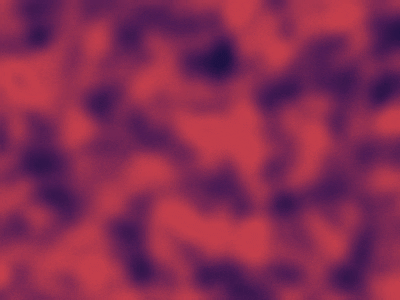

# Balatro Background Generator

This is a Rust program that generates looping background videos in the style of the game Balatro. It uses noise functions and color interpolation to create smooth, mesmerizing animations.

## Features

*   Generates looping background videos.
*   Customizable colors, speed, turbulence, and pixelation.
*   Parallel frame generation for faster video creation.

## Prerequisites

*   **Rust:** You need to have Rust installed. You can download it from [https://www.rust-lang.org/](https://www.rust-lang.org/).
*   **FFmpeg:** FFmpeg is required to combine the generated frames into a video. Make sure it's installed and available in your system's PATH. You can download it from [https://ffmpeg.org/](https://ffmpeg.org/).

## Installation

1.  **Clone the repository:**

    ```bash
    git clone <repository_url>
    cd balatro_bg
    ```

2.  **Build the project:**

    ```bash
    cargo build --release
    ```

    This will create an optimized executable in the `target/release` directory.

## Usage

Run the executable with the desired command-line arguments. Here's an example:

```bash
    ./target/release/balatro_bg \                                                                                                                               
    --output my_background.mp4 \
    --colors "#0f0f3c" \
    --colors "#4b1d52" \
    --colors "#802c52" \
    --colors "#c2414b" \
    --duration 20 \
    --fps 30 \
    --width 800 \
    --height 600 \
    --turbulence 2.0 \
    --pixelation 8 \
    --scale 0.08 \ 
    --speed 10
```

### Command-Line Arguments

*   `--output <filename>`: Output video filename (default: `balatro_background.mp4`).
*   `--colors <hex_color>`: List of colors in hex format (e.g., `#FF0000`). You can specify multiple `--colors` arguments.  A minimum of two colors is recommended.
*   `--duration <seconds>`: Duration of the video in seconds (default: `5.0`).  This determines the loop length.
*   `--fps <frames_per_second>`: Frames per second (default: `30`).
*   `--width <pixels>`: Video width in pixels (default: `800`).
*   `--height <pixels>`: Video height in pixels (default: `600`).
*   `--turbulence <value>`: Turbulence/violence of the swirls (default: `1.0`).  Higher values create more chaotic movement.
*   `--pixelation <value>`: Pixelation level (1 = no pixelation, default: `4`).  Higher values create larger pixels.
*   `--scale <value>`: Scale of the noise pattern (default: `0.003`).  Smaller values create finer patterns.
*   `--speed <value>`: Animation speed (default: `0.002`).  Adjust this to control how quickly the colors churn and morph.

### Examples
## Example Background

Here's an example of a background generated by this program:


*   **High-contrast, fast-moving color background:**

    ```bash
    ./target/release/balatro_bg \                                                                                                                      
    --output my_background.mp4 \
    --colors "#0f0f3c" \
    --colors "#4b1d52" \
    --colors "#802c52" \
    --colors "#c2414b" \
    --duration 20 \
    --fps 30 \
    --width 800 \
    --height 600 \
    --turbulence 2.0 \
    --pixelation 8 \
    --scale 0.08 \ 
    --speed 10
    ```

*   **Slowly churning black and white background:**

    ```bash
    ./target/release/balatro_bg \
      --output slow_bw_loop.mp4 \
      --colors "#000000" \
      --colors "#FFFFFF" \
      --duration 60 \
      --fps 30 \
      --width 800 \
      --height 600 \
      --turbulence 0.5 \
      --pixelation 6 \
      --scale 0.008 \
      --speed 0.8
    ```


## Troubleshooting

*   **FFmpeg not found:** If you get an error message about FFmpeg not being found, make sure it's installed and in your system's PATH.
*   **Video is not looping:** Ensure that you have applied the code modifications to the `generate_frame` function to enable looping. Also, verify that you have added the `"-flags", "+loop", "-shortest"` arguments to the ffmpeg command in the code.
*   **Line artifacts:** Try increasing the `--pixelation` value, using a different resizing filter (e.g., `Triangle` or `Lanczos3`), reducing the `--scale` value, or adding a blur as described in the code comments.

## Customization

Feel free to experiment with different color combinations, turbulence levels, pixelation settings, and speeds to create your own unique background animations.

## License

This project is licensed under the MIT License - see the [LICENSE](LICENSE) file for details.
```

